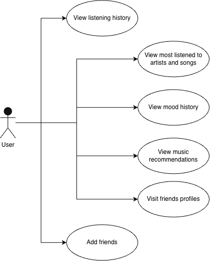

# Positioning

## Problem statement

## Product Position Statement

## Value proposition and customer segment
**Value proposition:** Interlude aims to give listeners an automatic music diary that tracks and visualizes their listening history over time, while using that history and time of day to recommend new music and resurface older songs that fit what they want to hear right now.
**Consumer segment:** Heavy music listeners who care about how their music is delivered or who want to share their music listening habits

# Functional requirements
1. The system tracks each user's most listened artist and genre.
2. User login session system.
3. User's data is automatically uploaded to the system.
4. User's can add friends.
5. User's can view friends stats.
6. The system generates music recommendations foreach user.

# Non-functional requirements
1. Usability - 80% of users can use and navigate the site without fustration or any help from the developers.
2. Availability - Deployments should have 0 seconds of downtime.
3. Performance - Any frontend page P50 load time should be within 3s.
4. Performance - Any backend P50 responses should be within 0.5s.
5. Availability - The system as a whole should have 4 9s of uptime.
6. Scalability - The system should scale up to 3 servers depending on the request load.
7. Maintainability - Every service in the backend has at least 1 integration test. 
8. Maintainability - Every pure function in both the frontend and backend has at least 1 unit test. 
9. Security - All user data is handled through the principle of least privilege.

# MVP
The minimum viable product should allow a user to login to their own account. THat account can be linked to get spotify listening history and begin storing the data. Future songs listened to after signing in should be tracked. Data will be stored/tracked/ordered with complete metadata, to show most listened to artists/genre, as well as at least 3 reccomended songs or artists based on the data. User can visit another profile and look at their statistics. All in a miniamlly designed UI that should be straightforward to begin with. 

# Use cases

## Use case diagram

## Use case descriptions and interface sketch
### Use case 1: (Title)

**Actor:**

**Trigger:**

**Pre-conditions:**

**Post-conditions:**

**Success Scenarios:**
1. replace
2. replace
3. replace

**Alternate Scenarios:** (Unsuccessfull)
- 2a. replace
- 2b. replace
- 3a. replace

### Use case 2: (User views most listned to artists/songs)

**Actor:**
User

**Trigger:**
User wants to view their music related data

**Pre-conditions:**
Logged in with account and synced with streaming platform

**Post-conditions:**
User has more info on their listening data

**Success Scenarios:**
1. The system stores and keeps track of their data
2. Data is displayed for user on dashboard

**Alternate Scenarios:** (Unsuccessfull)
- 1a Data being processed, inform user 
 

# User stories
- As a friend, I want to know what my friends are listening to, so that we can bond and chat about it.
  - **8 hours**
- As a heavy music listener, I want to track my most played songs, so that I can share with my friends.
  - **5 hours**
- As a casual music listener, I want to get recommendations so that I can expand my taste or find new music.
  - **21 hours**
- As a friend, I want to know what other people like to listen to, so that I can secretly steal their music taste.
  - **8 hours**
- As a Spotify user, I want to have a monthly Wrapped playlist, so that I can go back and listen to what I liked in previous months. 
  - **8 hours**
- As a YouTube Music user, I want better music recommendations, so that I don't have to listen to YouTube bad recommendations.
  - **21 hours**
- As a Apple Music user, I want to have better music stations, so that I can find tracks that are more similar to the track I want to listen to.
  - **21 hours**
- As a Illusi user, I want to have a yearly wrapped, so that I can see how my music grew over the year.
  - **13 hours**
- As an artist, I want to find people who heavily listen to my music, so that I can interact with my fanbase.
  - **81 hours**
- As a music listener, I want to blog about the music I listen to, so that I can express my world of music.
  - **21 hours**
- As a music listener, I want to review my mood history in my music, so that I can better keep track of mental state.
  - **5 hours**
- As a music listener, I want to see my most listen to artists and how much I listen to them, so that I can flex on Instagram.
  - **5 hours**

# Issue Tracker

# Member participation
- Daniel Raygoza (@Illusion137) - N/A
- Aidan Clarke (@alc963 / @Aidan15Clarke) - N/A
- Kacy Souvanna (@kas2536) - N/A
- Jeff Henry (@Chairmichael) - N/A
- Ronald Milton (@Ronald578) - N/A
- Sarah Rogala (@cringeybabey) - N/A
- Logan Kusheba (@) - N/A